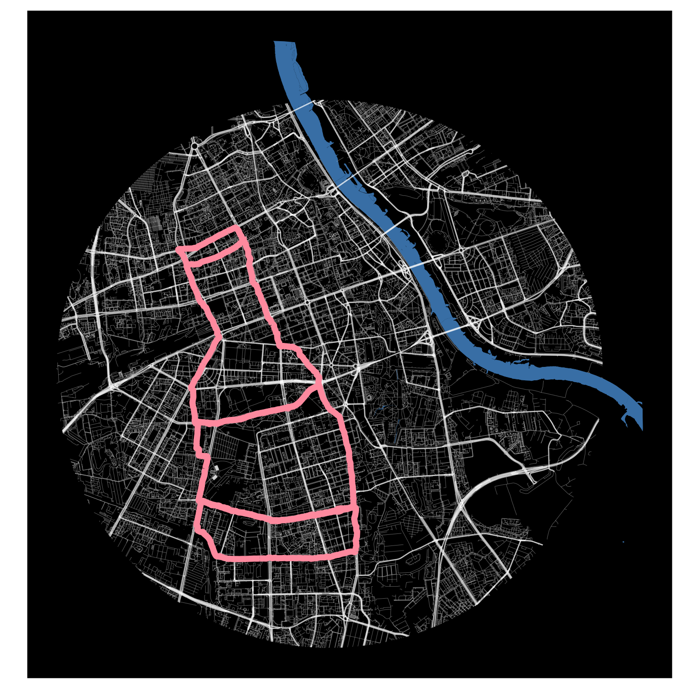

# Running-GIF

Project to create a visualisation of a physical activity recorded with in a form of GIF. 
The project utilises Open Street Map data (`osmdata`) to query roads data. `gganimate` is used to create frames of the visualisation which contain subsequent steps of the visualisation (which after the merge, create GIF). 

### Content:

`The_beer.gpx` -> .gpx file downloaded from Strava.

`Running_gif.R` -> R script written to create the visualisation.

`Strava_run.png` -> static activity map saved as `.png`
